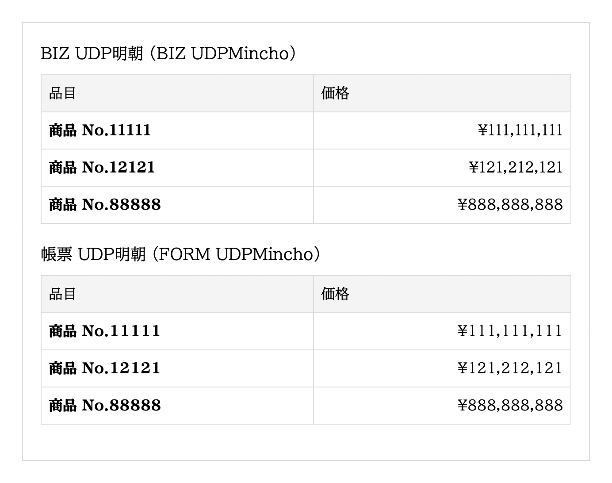

# 帳票 UDP明朝 (FORM UDPMincho)

**モリサワ [BIZ UDP明朝](https://github.com/googlefonts/morisawa-biz-ud-mincho) (Version 1.60) の「1」と「１（全角）」の幅のみを変更し、数字（0〜9）を等幅にしたフォントです（※）。** 

「[帳票 UDPゴシック](https://github.com/jz5/FORM-UDPGothic)」を作ったので、明朝も作りました。

「BIZ UDP明朝」のグリフ数 13,932個のうち2個を変更し、残りの約 99.9856% のグリフは全く同じです。

「BIZ UDP明朝」は「BIZ UDPゴシック」と異なり、Regular と Bold とで数字の幅が異なるため混在させると等幅にはなりません。つまり、「帳票 UDP明朝」でも Regular と Bold とで幅が異なります。

※「BIZ UDP明朝」は、0〜9 のうち 1 のみ幅（サイドベアリング）が異なる。

## ダウンロード

[Release](https://github.com/jz5/FORM-UDPMincho/releases) から。

## Repository

* diff: [Diffenator 2](https://github.com/googlefonts/diffenator2) によるフォントの差分レポート
* original: [Morisawa BIZ UDMincho](https://github.com/googlefonts/morisawa-biz-ud-mincho) のコピー
* release: 帳票 UDP明朝
* scripts: 生成スクリプトなど

## License

* フォント: [SIL Open Font License](https://openfontlicense.org/)
* scripts: [CC0](https://creativecommons.jp/sciencecommons/aboutcc0/)
